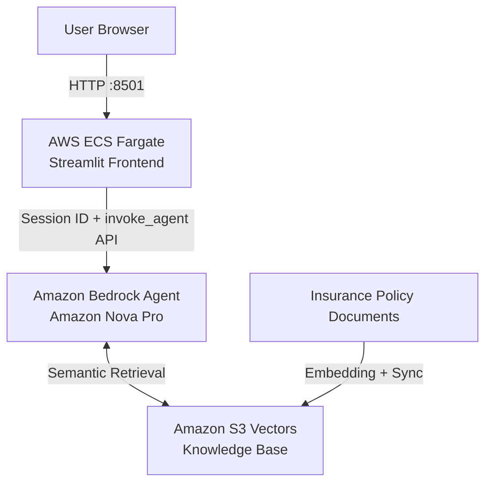
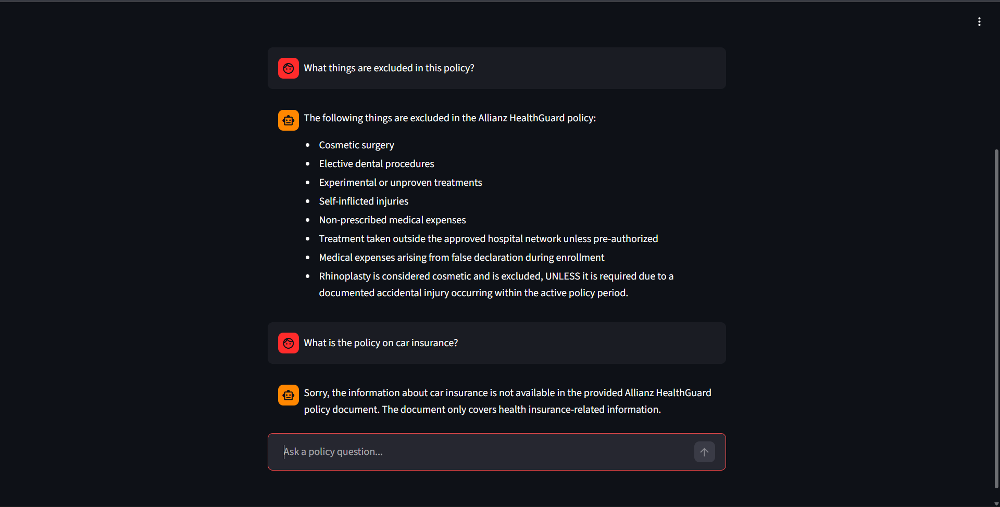

# HealthGuard AI Assistant

A Retrieval-Augmented Generation (RAG) AI web application designed to answer complex health insurance policy questions. This project was developed as a proof-of-concept enterprise RAG assistant within a restricted corporate sandbox environment. It demonstrates an architectural progression from a local LangChain prototype to a decoupled, serverless cloud application on AWS ECS Fargate.

## 🏗️ Architecture


The Streamlit frontend runs as a lightweight stateless container on AWS ECS Fargate. 
User prompts are routed to an Amazon Bedrock Agent using the `invoke_agent` API, where retrieval-augmented generation is performed against policy embeddings stored in Amazon S3 Vectors.

## 🛠️ Tech Stack

* **Cloud Infrastructure:** AWS ECS (Fargate), Amazon ECR, AWS VPC
* **Orchestration:** Amazon Bedrock Agents, Amazon Nova Pro
* **Vector Storage:** Amazon S3 Vectors
* **Frontend:** Streamlit, Python (`boto3`)
* **Containerization:** Docker

---

## 🖥️ Application Demo


### Policy Exclusion Retrieval + Domain Guardrails

The assistant retrieves policy exclusions while refusing out-of-scope questions unrelated to health insurance.

---

## ⚙️ Architectural Evolution

### Phase 1: Local Prototype

The initial build focused on establishing the core RAG logic and defensive programming locally.

* **Vector Store:** Utilized `RecursiveCharacterTextSplitter` to chunk policy rules, embedded and stored locally using ChromaDB.
* **Tool Calling:** Converted the RAG retriever into a searchable tool using custom Python `@tool` decorators to calculate mathematical logic (e.g., premium surcharges) dynamically.
* **Defensive Parsing:** Implemented data validation to parse raw LLM strings into floats to prevent Pydantic validation crashes, and cleanly parsed 'Content Blocks' for the Streamlit UI.

### Phase 2: Serverless Backend Migration

To prepare for scalable deployment, the machine learning dependencies were migrated to managed AWS services.

* **S3 Vector Database:** Replaced the local ChromaDB with Amazon S3 Vectors. S3 Vectors provided a lightweight managed vector storage solution without requiring dedicated OpenSearch infrastructure, which successfully bypassed strict organizational Service Control Policies (SCPs).
* **Bedrock Agents:** Shifted orchestration, memory management, and tool-calling entirely to AWS by replacing the local LangChain execution environment with Bedrock Agents.
* **EULA Compliance:** Discovered that Sandbox IAM roles restricted the acceptance of third-party Marketplace EULAs. Mitigated this by pivoting the agent to the Amazon Nova first-party model, ensuring data compliance without sacrificing inference quality.

### Phase 3: Frontend Decoupling

The Streamlit application was stripped of its ML dependencies to act purely as a stateless presentation layer.

* **API Integration:** Routed user prompts directly to the Bedrock Agent via the `invoke_agent` API over the public internet.
* **Session Management:** Implemented dynamic session state management using Python's `uuid` library to ensure the Bedrock Agent maintains discrete chat memory for concurrent users.
* **Dockerization:** Authored a lightweight `Dockerfile` using a Python `slim` image for portable container deployment.

---

## 🚀 Cloud Deployment & Infrastructure Challenges

The final application is hosted on **Amazon ECS** using serverless **AWS Fargate** compute. Deploying this architecture within a strictly governed corporate sandbox presented several real-world DevOps challenges that were successfully resolved:

1. **Service Deprecation Pivot:** During the final deployment phase, AWS officially deprecated App Runner for new workloads. I immediately adapted the architectural strategy to deploy via Amazon ECS Fargate, ensuring the application launched on supported infrastructure.
2. **Navigating Strict IAM Role Restrictions:** Enterprise sandbox environments often block the creation of custom ECS Task Roles. To allow the container to authenticate with Bedrock, I implemented a bypass by securely injecting transient AWS federated credentials directly into the ECS container's environment variables.
3. **Zero-Downtime Credential Rotation:** Because the injected sandbox tokens expire every 24 hours, the application would occasionally throw an `ExpiredTokenException`. This was resolved by establishing a manual key-rotation pipeline: creating new ECS Task Revisions and executing "Force New Deployments" to spin up fresh containers with new keys seamlessly.
4. **Automated VPC Routing & Provisioning:** Initial ECS clusters failed to provision due to the lack of default networking. I utilized the AWS VPC Wizard to build a custom Virtual Private Cloud with dedicated public subnets and an attached Internet Gateway, enabling the Fargate tasks to successfully pull images from the private Amazon ECR vault and expose port `8501` to the public internet.
5. **Local Docker Daemon Synchronization:** Overcame local WSL2 engine crashes (`500 Internal Server Error`) during the container build process by executing hard resets of the underlying Windows Subsystem for Linux, ensuring reproducible image builds for the local fallback demo.

---

## 📂 Project Structure

```text
insurance_bot/
├── .env                  # Ephemeral AWS credentials (Not tracked in git)
├── app.py                # Decoupled Streamlit frontend and Bedrock API router
├── Dockerfile            # Blueprint for the lightweight UI container
├── requirements.txt      # Minimized dependencies (streamlit, boto3, python-dotenv)
├── data/
│   └── policy.txt        # Raw insurance policy document (Synced to S3 Vectors)
└── docs/
    └── demo-screenshot.png # Application screenshots for documentation
```

> *For comprehensive instructions on provisioning the AWS backend and deploying the cloud infrastructure from scratch, please see the [Deployment Guide](DEPLOYMENT.md).*

## 💻 Running the Local Fallback Demo

If cloud infrastructure is temporarily unavailable, the fully containerized application can be run locally while still leveraging the remote AWS Bedrock backend.

1. Ensure Docker Desktop is running.
2. Inject valid AWS credentials into the local `.env` file.
3. Build the image:
```bash
docker build -t healthguard-local .
```


4. Run the container with exposed ports and environment variables:
```bash
docker run -p 8501:8501 --env-file .env healthguard-local
```


5. Access the application at `http://localhost:8501`.


## Acknowledgments & Disclosure
*This project was developed as part of an AI Engineering internship at Allianz. Proprietary data and internal architecture specifics have been abstracted or removed for this public repository to comply with corporate security guidelines.*